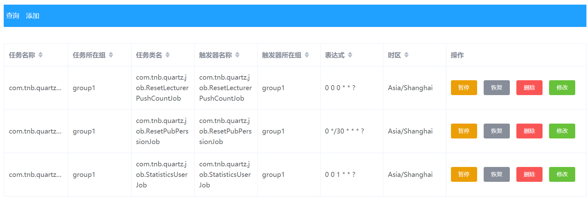

# learn-quartz
learn-quartz
## quartz example
  1. 基于springboot 2.2.13.RELEASE 版本
  2. quartz.version 2.2.1
## quartz 配置信息
```properties
## 调度器名称,实例ID自动生成
org.quartz.scheduler.instanceName = DefaultQuartzScheduler
org.quartz.scheduler.instanceId = AUTO
org.quartz.scheduler.rmi.export = false
org.quartz.scheduler.rmi.proxy = false
## 线程池
org.quartz.threadPool.class = org.quartz.simpl.SimpleThreadPool
org.quartz.threadPool.threadCount = 10
org.quartz.threadPool.threadPriority = 5
org.quartz.threadPool.threadsInheritContextClassLoaderOfInitializingThread = true
## 持久化到数据库
org.quartz.jobStore.useProperties=true
org.quartz.jobStore.class=org.quartz.impl.jdbcjobstore.JobStoreTX
org.quartz.jobStore.driverDelegateClass=org.quartz.impl.jdbcjobstore.StdJDBCDelegate
org.quartz.jobStore.misfireThreshold = 60000
## true 开启集群配置
org.quartz.jobStore.isClustered = true
org.quartz.jobStore.tablePrefix = QRTZ_
org.quartz.jobStore.acquireTriggersWithinLock=true
org.quartz.jobStore.dataSource =qzDB
## 数据库连接信息与连接池
org.quartz.dataSource.qzDB.provider=hikaricp
org.quartz.dataSource.qzDB.driver=com.mysql.cj.jdbc.Driver
org.quartz.dataSource.qzDB.URL=jdbc:mysql://192.168.174.129/quartz?useUnicode=true&characterEncoding=utf-8&useLegacyDatetimeCode=false&serverTimezone=UTC
org.quartz.dataSource.qzDB.user=root
org.quartz.dataSource.qzDB.password=123456
org.quartz.dataSource.qzDB.maxConnections=1000
```
## quartz 库表结构说明
    QRTZ_BLOG_TRIGGERS
        Trigger 作为 Blob 类型存储(用于 Quartz 用户用 JDBC创建他们自己定制的 Trigger 类型，JobStore 并不知道如何存储实例的时候)
    QRTZ_CALENDARS 
        以 Blob 类型存储 Quartz 的 Calendar 信息
    QRTZ_CRON_TRIGGERS 
        存储 Cron Trigger，包括 Cron表达式和时区信息
    QRTZ_FIRED_TRIGGERS 
        存储与已触发的 Trigger 相关的状态信息，以及相联 Job的执行信息 
    QRTZ_PAUSED_TRIGGER_GRPS 
        存储已暂停的 Trigger 组的信息
    QRTZ_SCHEDULER_STATE 
        存储少量的有关 Scheduler 的状态信息，和别的 Scheduler实例(假如是用于一个集群中)
    QRTZ_LOCKS 
        存储程序的悲观锁的信息(假如使用了悲观锁)
    QRTZ_JOB_DETAILS 
        存储每一个已配置的 Job 的详细信息
    QRTZ_JOB_LISTENERS 
        存储有关已配置的 JobListener 的信息
    QRTZ_SIMPLE_TRIGGERS 
        存储简单的Trigger，包括重复次数，间隔，以及已触的次数
    QRTZ_TRIGGER_LISTENERS 
        存储已配置的 TriggerListener 的信息
    QRTZ_TRIGGERS 
        存储已配置的 Trigger 的信息

## dashboard 界面添加cron 任务


## 参考信息
[1] : [cron在线表达式编辑器](https://cron.qqe2.com/)

[2] : [yaml与properties在线互转](https://www.toyaml.com/index.html)

[3] : [在线时间戳转日期](https://www.beijing-time.org/shijianchuo/)

[4] : [Quartz配置Springboot自带连接池Hikaricp](https://blog.csdn.net/weixin_38553453/article/details/91993066)

[5] : [Quartz集群原理与配置](https://www.cnblogs.com/zhenyuyaodidiao/p/4755649.html)

